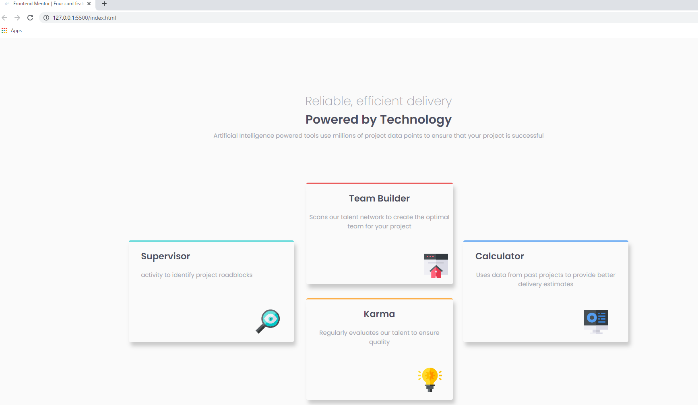

# Frontend Mentor - Four card feature section solution

This is a solution to the [Four card feature section challenge on Frontend Mentor](https://www.frontendmentor.io/challenges/four-card-feature-section-weK1eFYK). Frontend Mentor challenges help you improve your coding skills by building realistic projects. 

## Table of contents

- [Overview](#overview)
  - [The challenge](#the-challenge)
  - [Screenshot](#screenshot)
  - [Links](#links)
- [My process](#my-process)
  - [Built with](#built-with)
  - [What I learned](#what-i-learned)
  - [Continued development](#continued-development)
  - [Useful resources](#useful-resources)
- [Author](#author)
- [Acknowledgments](#acknowledgments)

**Note: Delete this note and update the table of contents based on what sections you keep.**

## Overview

### The challenge

Users should be able to:

- View the optimal layout for the site depending on their device's screen size

### Screenshot




**Note: Delete this note and the paragraphs above when you add your screenshot. If you prefer not to add a screenshot, feel free to remove this entire section.**

### Links

- Solution URL: [Add solution URL here](https://github.com/dmug1/FM_4cardsction)
- Live Site URL: [Add live site URL here](https://dmug1.github.io/FM_4cardsction/)

## My process

### Built with

- Semantic HTML5 markup
- CSS custom properties
- Flexbox
- Mobile-first workflow


**Note: These are just examples. Delete this note and replace the list above with your own choices**

### What I learned

Use this section to recap over some of your major learnings while working through this project. Writing these out and providing code samples of areas you want to highlight is a great way to reinforce your own knowledge.

To see how you can add code snippets, see below:

```html
    <div class = cards-group>
      
      <div class="card" id="supervisor">
        <h2>Supervisor</h2>
        <span> activity to identify project roadblocks</span>
        
      </div>

      <div class='vcardblock'>
        <div class="card" id="teamBuilder">
          <h2>Team Builder</h2>
          <span>Scans our talent network to create the optimal team for your project</span>
          
        </div>
        
        <div class="card" id="karma">
          <h2>Karma</h2>
          <span>Regularly evaluates our talent to ensure quality</span>
          
        </div>
      </div>

      <div class="card" id="calculator">
        <h2>Calculator</h2>
        <span>Uses data from past projects to provide better delivery estimates</span>
        
      </div>

    </div>
```
```css
.cards-group{
    display: flex;
    flex-wrap: wrap;        
    flex-direction: row;
    padding: 0% 10%;
    gap: 2%;
    height: 100%;
    align-items: center;
    justify-content: center; 
    margin-bottom: 5%;
}
```

### Continued development

Use this section to outline areas that you want to continue focusing on in future projects. These could be concepts you're still not completely comfortable with or techniques you found useful that you want to refine and perfect.

## Author

- Website - Diego Mugnae 
- Frontend Mentor - [@dmug](https://www.frontendmentor.io/profile/dmug1)